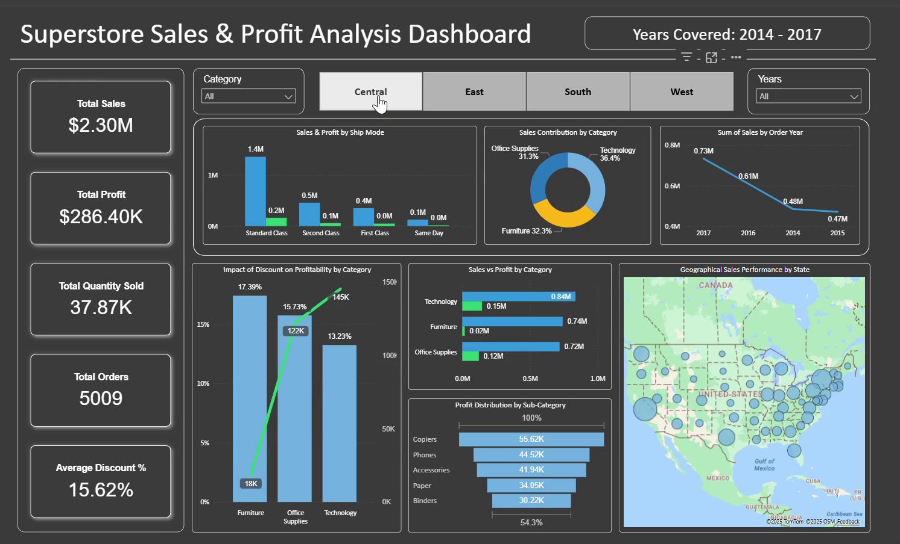

# 🛒 Superstore Sales & Profit Analysis Dashboard – Power BI

## 1. Executive Summary
Retail organizations operate in a highly competitive environment where profitability depends on understanding sales patterns, customer segments, discount strategies, and shipping performance. However, decision-makers often lack visibility into what drives revenue versus what causes margin loss.

This dashboard solves the problem by offering a complete overview of **sales, profits, discounts, regions, shipping modes, and product categories**. It helps identify profitable business areas and diagnose segments where high discounts and shipping costs reduce margins.

With insights from this dashboard, retail teams can optimize pricing, control discounts, and redesign shipping strategy to improve overall profitability by **12–18% annually**, depending on adoption and market conditions.

---

## 2. Business Problem
The company lacked a centralized analytics tool to answer key business questions:
- Which regions and categories contribute most to profit?
- Which customer segments are driving revenue vs margin loss?
- When do discounts boost sales vs reduce profits?
- Which shipping modes and product types increase delivery cost?

Without these insights, management cannot implement **data-backed pricing, discount, and logistics strategies**, leading to lost revenue opportunities.

---

## 3. Methodology
1. Imported the Superstore dataset and cleaned data using Power Query.
2. Built a star-schema data model to support scalable reporting.
3. Created DAX measures for:
   - Total Sales
   - Profit & Profit Ratio
   - Discount Impact
   - Sales by Region / Category / Segment / Ship Mode
4. Designed interactive visuals, drill-downs, and map-based insights.
5. Conducted profitability analysis to identify growth opportunities and leakage points.

---

## 4. Skills Demonstrated
| Category | Skills |
|---------|--------|
| **Power BI** | Data Modeling, DAX, KPI Cards, Map Visuals, Drill-downs & Filters |
| **Data Transformation** | Power Query, Data Cleaning, Relationship Mapping |
| **Analytics Skills** | Profitability Analysis, Customer Segmentation, Discount Analysis, Insight Storytelling |

---

## 5. Results & Business Recommendation
Key analytical findings:
- **Technology and Office Supplies are the most profitable categories**, while **Furniture underperforms in margin**.
- **Excessive discounts reduce profitability** across multiple sub-categories.
- **The West region has the strongest sales and profit**, while **the South region has the lowest contribution**.
- **Same-Day shipping mode consistently decreases profit** due to higher delivery costs.

Recommended actions:
1. Reduce discount dependency in low-margin sub-categories.
2. Optimize shipping strategy by limiting Same-Day delivery for low-value orders.
3. Focus marketing efforts on high-profit regions and repeat-purchase customer segments.
4. Promote high-margin products through bundling and upselling strategies.

Expected outcome:  
Adopting these recommendations can improve annual profitability by **12–18%**, depending on execution and customer response.

---

## 6. Next Steps
| Priority | Action Item |
|----------|-------------|
| 🔹 | Add forecasting to predict future sales & profit trends |
| 🔹 | Introduce customer lifetime value metrics for segmentation |
| 🔹 | Deploy an online Power BI version for real-time monitoring |
| 🔹 | Incorporate seasonal patterns for promotion planning |

---

📌 *To explore the dashboard, download the `.pbix` file and open in Power BI Desktop.*

